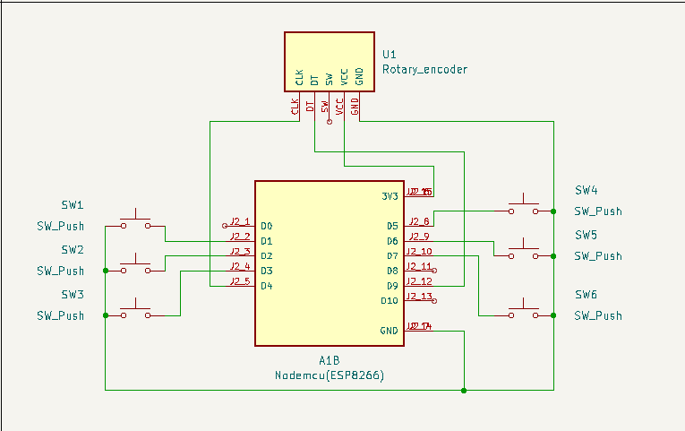

# Macropad
# 🧠 Macropad - PC Shortcut Controller

A custom-built macropad using **NodeMCU (ESP8266)** and **rotary encoder**, designed to trigger common PC shortcuts like:
**Copy, Paste, Undo, Redo, Screenshot, Print**, and **Volume Control**.

---

## 🚀 Features

- 6 Push Buttons mapped to:
  - 📋 Copy (`Ctrl + C`)
  - 📄 Paste (`Ctrl + V`)
  - ↩️ Undo (`Ctrl + Z`)
  - 🔁 Redo (`Ctrl + Y`)
  - 🖨️ Print (`Ctrl + P`)
  - 📸 Screenshot (`Win + Shift + S`)
- Rotary encoder:
  - 🔊 Volume Up/Down
  

---

## 📷 Schematic

---

## 🧰 Hardware Used

| Component         | Quantity |
|------------------|----------|
| NodeMCU (ESP8266)| 1        |
| Push Buttons     | 6        |
| Rotary Encoder   | 1        |
| Breadboard       | 1        |
| Jumper Wires     | Many     |

---

## 🔌 Wiring

| Function       | NodeMCU GPIO |
|----------------|--------------|
| Button: Copy   | GPIO 5           |
| Button: Paste  | GPIO 4           |
| Button: Undo   | GPIO 14          |
| Button: Redo   | GPIO 12          |
| Button: Print  | GPIO 13          |
| Button: Screenshot | GPIO 0       |
| Rotary CLK     | GPIO 2           |
| Rotary DT      | GPIO 3           |

---

